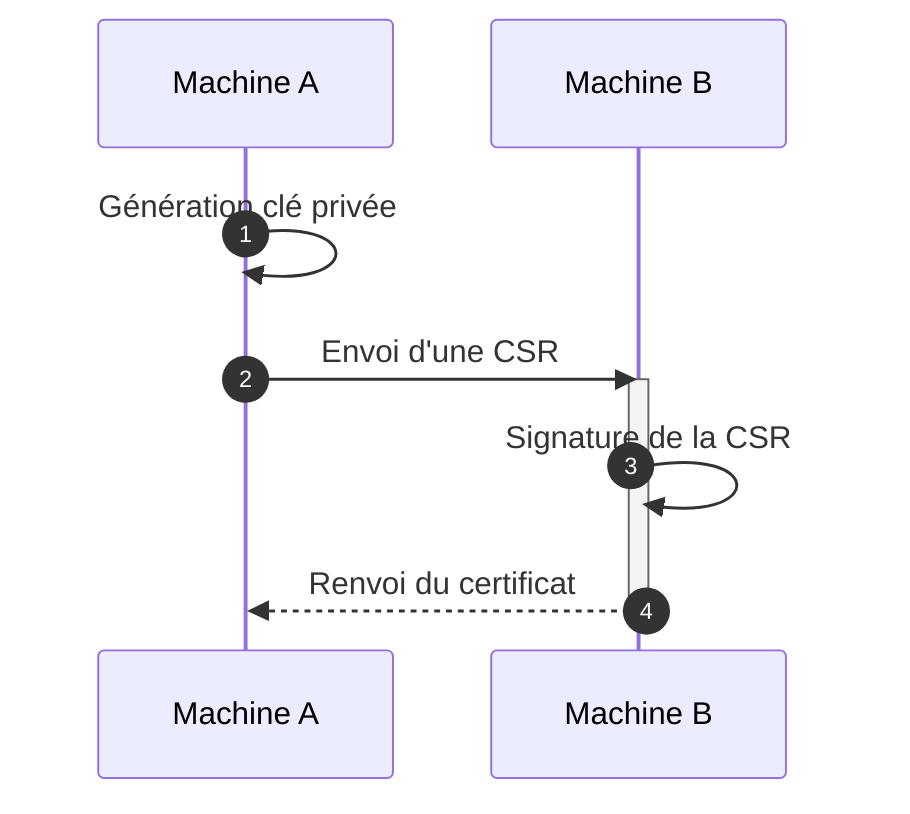
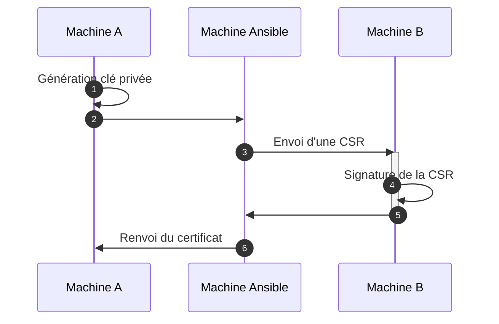

<!-- TODO rework
Ansible est une technologie incroyable : versatile ( [configuration](#) de [serveurs](#) ? du [réseau](#) ? [event-driven depl](#) ?), programmé en Python, idempotent, et simple.

Pour les débutants, ces deux dernières qualités en font un outil de choix : qui n'a jamais eu la chance d'utiliser un script Bash ne couvrant pas les cas limites, dont l'arrêt impromptu laisse un état indéterminé ? L'alternative étant de noyer le script sous les trap, set -euo pipefail et autre shenanigans de process en tâche de fond...

La promesse d'Ansible est simple : quelques lignes de YML, et un module dédié prend en charge non seulement la réalisation de l'opération, mais également la vérification de l'état décrit : si aucun changement n'est nécessaire, aucune opération n'est réalisée.

Ajoutez à cela la possibilité de configurer un ensemble de machines en parallèles selon un scénario prédéfini, et l'on semble découvrir une panacée...

... si ce n'est pour l'un des concepts les plus importants de l'informatique :

> Le code le plus difficile à créer est le plus simple

En effet, Ansible fait très bien les chose, mais s'il les *présente* comme un script, l'opération réelle est *très* différente, et semblera *contre-intuitive*, voire *anormale*, pour le néophyte.

-->

# Etude de cas : la fourniture de certifiaat

Prenont un cas assez simple et réccurent : une machine B sert d'autorité de certification à une infrastructure ; elle doit générer un certificat pour une machine A. Le processus est le suivant :



## Première approche : un script Bash à l'arrache

La génération d'un certificat pourrait prendre la forme suivante en Bash (executé sur la machine A) :

```bash
openssl genrsa -out private_key.pem 2048
openssl req -new -key private_key.pem -out mycsr.csr
scp mycsr.csr ca-user@machineB:
ssh ca-user@machineB openssl ca -in mycsr.csr -out mycert.pem -batch
scp ca-user@machineB:/mycert.pem ./
```

Cette approche est *simple*, et facile à maintenir, mais pose plusieurs problèmes :
- Que se passe-t-il si la clé existe déjà ?
- Que se passe-t-il si la CSR existe déjà ?
- Que se passe-t-il si le certificat existe déjà ?
- Comment paramétrer les dossiers de destination (notemment pour restreindre l'accès à la clé privée) ?
- La résiliation de certificats n'est pas prise en compte

## 2nde approche : Playbook Ansible à l'arrache

Ansible permet de résoudre une partie de ces problèmes : en effet, par l'utilisation d'un module exposant une interface simple, il devient possible de prendre en compte les effets de bords précédents (le module les gère), sans cout de maintenance supplémentaire (le module étant maintenu par la communauté).

Imaginons maintenant que je suis un complèt débutant, et que je n'ai pas le temps de lire la documentation : la seule connaissance que j'ai d'Ansible, c'est que c'est un injecteur SSH configuré en YAML. Alors, je serai tenté de calquer le script précédent. Le playbook ressemblerait alors à cela :

```yaml
- hosts: machine A
  tasks:
    - name: générate private key
    - name: générate CSR
    - name: copy CSR from machine A

- hosts: machine B
  tasks:
    - name: copy CSR to machine B
    - name: sign certificate
    - name: copy certificate from machine A

- hosts: machineA
  tasks:
    - name: copy certificate from machine A
```

waaaaaaaait. il n'y a pas 5 étapes, mais plus ! En effet, si je cherche à copier un fichier via ansible, **le module `copy` ne peux copier que vers la machine Ansible !**
 
Aucun problème pour le débutant : il suffit d'intégrer la machine ansible au milieu, et problème résolu.


Tout va bien dans le meilleur des mondes, n'est-ce pas ?

... **Pas du tout.** Cette approche est problématique pour deux raisons :
1. Pour intégrer plusieurs ensembles de tâches non corréllées, Ansible privilégie l'utilisation de rôles. Or, un rôle ne peux être exécuté sur deux hôtes au sein du même rôle[^1], ce qui impliquerait d'avoir trois rôles différents pour ne réaliser qu'une unique fonction. 

[^1]: Du moins, du point de vue du débutant dont nous prenons le point de vue. La fonctionnalité `delegate_to` permet d'executer une tâche ponctuelle sur un autre hôte, mais elle vient avec ses propres contrepartie. Par exemple, dans le cas étudier, déléguer une tâche `copy` entrainera toujours une copie vers la machine Ansible. Nous donnerons plus loin un exemple d'utilisation.

## 3eme approche : Ansible the hard way

Prenon maintenant la place d'un développeur expérimenté en playbooks Ansible : il ne connais pas que la documentation des modules, mais également de nombreux outils, astuces et retours d'expérience qui lui permettrons de réaliser le playbook suivant. Essayez de voir si vous pouvez identifier toutes les astuces utilisées 

```yaml
- hosts: machine A
  tasks:
    - name: générate private key
    - name: générate CSR
      openssl_x509_pipe
      register:
    - name: sign certificate
    delegate_to: machine B
    - name: Write certificate from machine A
```

Que peux-t-on remarquer ? En premier abord, **uniquement 4 etapes, et pas 5.** En effet, l'étape de signature et de copie sont ici regroupées  par le module `machin`, qui enregistre le certificat signé dans une varible !

D'autres astuces ont été utilisées :
- la délégation uniquement de la signature, afin
- le module `copy` ne copie pas seulement els fichiaer, mais peut également écrire dans un fichier via le paramètre `content`

Organisé de cette façon, ces tâches peuvent être assemblées dans un rôle, versionné, partagé et installé par les outils habituels comme `ansible-galaxy`… Il respecte beaucoup mieux les bonnes pratiques ansible.

Il y a *beaucoup* de petites choses de cet acabis qui s'éloignent des pratiques de scripting conventionnel, mais qui utilisent mieux la puissance d'Ansible pour l'automatisation.

En somme, il est possible de produite un automatisation *simple*, plus qu'avec un script Bash par exemple ; mais c'est loi d'être *facile*, car il faut très bien connaitre l'outil et son fonctionnement.

<!-- Notes -->
## Comment copier un fichier

<!-- Notes -->
cherche sur SO si c'est facile de déplacer un fichier (genre  certificat) d'un noeud A à un noeud B... LOL C'EST MORT xDDDDDD

On peut se dire : "je veux copier un fichier, alors go `copy`"... mais c'est que d'un noeud managed à un autre, alors je vais faire ça en trois temps...

schéma : A -> Ansible -> B ; del sur Ansible

et on se retrouve avec 3 play/role, juste pour déplacer un fichier. LMAO

Comment faire (au plus simple):

```yaml
- name: Get file content in variable
  slurp:
    src: chemin/vers/mon/fichier
  register: mon_fichier
  delegate_to: server_A

- name: Ecrit le contenu
  copy:


```

Oué mais frère, à ce moment il faut
- Savoir que le module slurp existe
- Savoir ce qui est register par ce module (dont le contenu du fichier)
- Savoir que le contenu est codé en b64, donc sera à décoder (!!!)
- savoir que delegate_to existe
- savoir comment il fonctionne (est-ce que server_a se connecte direct à B ? Non !)
- Savoir que copy n'utilise pas que src et dest, mas fonctionne aussi avec content

Oof, ça fait du monde, juste pour copier un fichier !

## Comment générer un certificat

même combat, il y a deux modules pour openssl certif. x509 et x509 pipe. COmment savoir lequel prendre ?

La doc est LITTERALLEMENT la même... sauf les return values !!!

On a donc une application de Ansible "brutale, au plus direct" qui est une convolution de 5 ou 6 roles, et la version subtile qui n'en prend que 2... mais qui demande une maitrise et de l'expérience, donc du temps (et c'est bien le nerf de la guerre... cf lien pertinent)

bref : Ansible c'est simple, mais pas facile (pour le faire bien).
